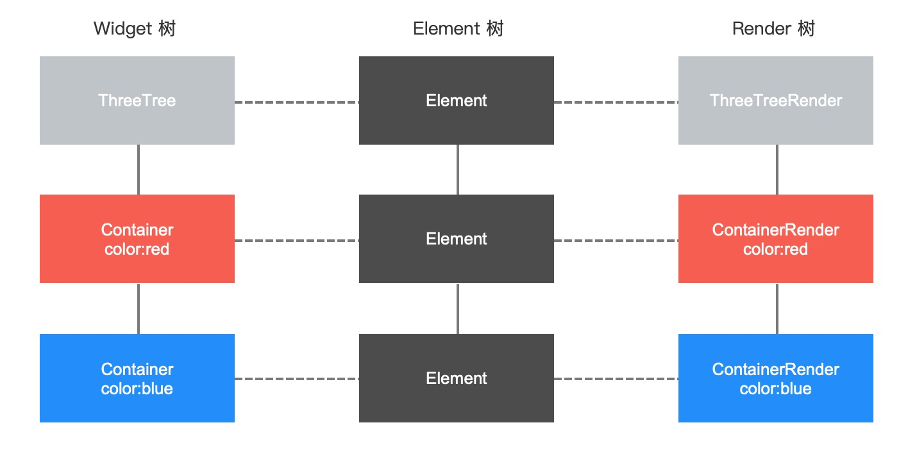

# flutter_bili_app

## Notes

```dart
///需要登录的异常
class NeedLogin extends HiNetError {
  NeedLogin({int code: 401, String message: '请先登录'}) : super(code, message);
}

///需要授权的异常
class NeedAuth extends HiNetError {
  NeedAuth(String message, {int code: 403, dynamic data})
      : super(code, message, data: data);
}

///网络异常统一格式类
class HiNetError implements Exception {
  final int code;
  final String message;
  final dynamic data;

  HiNetError(this.code, this.message, {this.data});
}
```

关于网络请求的异常封装

- 首先定义异常基类，构造函数 data 可选
- 然后定义来个常见的派生类：需要登录、无权访问，其他异常就 基类 顶上
- 需要登录没 data
- 无权访问 则构造函数都要传三个属性

```dart
/// 网络请求抽象类
abstract class HiNetAdapter {
  Future<HiNetResponse<T>> send<T>(BaseRequest request);
}
```

- 为啥要创建 `Adapter` 抽象类
- 我们需要所有的 `DioAdapter` `MockAdapter` `GetxAdapter` 都要规矩办事
- 主要是可以放回统一的响应体格式，这样上层操作员，根本不用管底层实现
- 而且这个 `Adapter` 只管发送数据

### JSON

- `flutter packages pub run build_runner build`

## Navigator 2.0


> 十分精华，终于找到迁移的感觉了！

```dart
void main() {
  runApp(BiliApp());
}

class BiliApp extends StatefulWidget {
  BiliApp({Key? key}) : super(key: key);

  @override
  _BiliAppState createState() => _BiliAppState();
}

class _BiliAppState extends State<BiliApp> {
  BiliRouteDelegate _routeDelegate = BiliRouteDelegate();

  @override
  Widget build(BuildContext context) {
    // 定义 route
    var widget = Router(
      routerDelegate: _routeDelegate,
    );

    return MaterialApp(
      home: widget,
    );
  }
}
```

> 上面这个代码，如果在有业务需求先本地搞点事情读点缓存，再确定怎么渲染时是无法做的到。
>
> 所以我们必须改造：

```dart

```

### HiState

- 为什么要封装 `HiState`
  - 处理页面状态异常
  - `setState()` called after dispose() 问题分析

### 上下拉刷新

- 当我们列表长度不足以撑满一个屏幕时，无法刷新，这样是不对的
  - 这个是 Flutter 的默认行为
  - `physics: const AlwaysScrollableScrollPhysics()`

### BackButton

```dart
// 框架里 BackButton 源码节选
// 可以不设置 onPressed，让它自动 Navigator 调用返回
Widget build(BuildContext context) {
    assert(debugCheckHasMaterialLocalizations(context));
    return IconButton(
      icon: const BackButtonIcon(),
      color: color,
      tooltip: MaterialLocalizations.of(context).backButtonTooltip,
      onPressed: () {
        if (onPressed != null) {
          onPressed!();
        } else {
          Navigator.maybePop(context);
        }
      },
    );
  }
```

### 解决安卓和苹果系统沉浸式播放状态栏兼容


```dart
  Widget build(BuildContext context) {
    return Scaffold(
        body: MediaQuery.removePadding(
      removeTop: Platform.isIOS,
      context: context,
      child: Column(children: [
        // 修复iOS平台状态栏
        NavigationBar(
          color: Colors.black,
          statusStyle: StatusStyle.LIGHT_CONTENT,
          height: Platform.isAndroid ? 0 : 46,
        ),
        _videoView(),
        Text('视频详情页, vid: ${widget.videlModel.vid}'),
        Text('视频详情页, title: ${widget.videlModel.title}'),
      ]),
    ));
  }
```

### iOS退出全屏问题修复

```dart
// 特别针对 iOS 修复退出全屏问题
void _fullScreenListener() {
  Size size = MediaQuery.of(context).size;
  if (size.width > size.height) {
    OrientationPlugin.forceOrientation(DeviceOrientation.portraitUp);
  }
}
```

### 安卓端后台切换APP再次进入问题修复

- 在 `APP` 中，返回桌面，退出 `APP` 放入后台，再进入时，我们状态栏就 **“坏了”**
- 所以我们必须在 `APP` 中能监听 `APP` 的状态：从后台再次进入APP
- 有了这个监听我们就能每次后台进入修复一次状态栏问题
- 这个时候我们需要让这个 `Widget` 去实现 `WidgetsBindingObserver` 这个抽象类
- 然后就可以注册声明周期函数

```dart
///监听应用生命周期变化
@override
void didChangeAppLifecycleState(AppLifecycleState state) {
  super.didChangeAppLifecycleState(state);
  print(':didChangeAppLifecycleState:$state');
  switch (state) {
    case AppLifecycleState.inactive: // 处于这种状态的应用程序应该假设它们可能在任何时候暂停。
      break;
    case AppLifecycleState.resumed: //从后台切换前台，界面可见
      //fix Android压后台首页状态栏字体颜色变白，详情页状态栏字体变黑问题
      changeStatusBar();
      break;
    case AppLifecycleState.paused: // 界面不可见，后台
      break;
    case AppLifecycleState.detached: // APP结束时调用
      break;
  }
}
```

```dart
void initState() {
  super.initState();

  WidgetsBinding.instance?.addObserver(this);

  _controller = TabController(length: categoryList.length, vsync: this);
  HiNavigator.getInstance().addListener(this.listener = (current, pre) {
    // this._currentPage = current.page;
    print('home:current:${current.page}');
    print('home:pre:${pre.page}');
    if (widget == current.page || current.page is HomePage) {
      print('首页: onResume');
    } else if (widget == pre?.page || pre?.page is HomePage) {
      print('首页: onPause');
    }

    // 当页面返回到首页恢复首页的状态栏样式
    // 为什么出现这个问题，就是视频详情页引起的
    if (pre?.page is VideoDetailPage && !(current.page is ProfilePage)) {
      var statusStyle = StatusStyle.DARK_CONTENT;
      changeStatusBar(color: Colors.white, statusStyle: statusStyle);
    }
  });

  loadData();
}
```

> 其实若有其他这样沉浸时状态栏页面切换修复也可以用这样的方式修复。

- 要注意避免Flutter嵌套太深而导致的代码可读性差的问题，需考虑使用扁平化的代码构造

### 封装TabView上下拉刷新

```dart
abstract class HiBaseTabState<M, L, T extends StatefulWidget> extends HiState<T>
    with AutomaticKeepAliveClientMixin {
  int pageInde = 1;
  List<L> dataList = [];
  bool loading = false;

  ScrollController scrollController = ScrollController();

  get contentChild;

  @override
  void initState() {
    super.initState();
    scrollController.addListener(() {
      // 最大可滚动距离 - 当前滚动距离
      var distance = scrollController.position.maxScrollExtent -
          scrollController.position.pixels;
      if (distance < 300 && !loading) {
        loadData(loadMore: true);
      }
    });
    loadData();
  }

  @override
  void dispose() {
    scrollController.dispose();
    super.dispose();
  }

  @override
  Widget build(BuildContext context) {
    super.build(context);
    return RefreshIndicator(
      child: MediaQuery.removePadding(
        removeTop: true,
        context: context,
        child: contentChild,
      ),
      onRefresh: loadData,
      color: primary,
    );
  }

  /// 根据对应页码获取相应数据
  Future<M> getData(int pageIndex);

  ///从M中解析出list数据
  List<L> parseList(M result);

  Future<void> loadData({loadMore = false}) async {
    if (loading) {
      print("...上次加载还没完成...");
      return;
    }

    loading = true;

    if (!loadMore) {
      pageInde = 1;
    }
    var currentIndex = pageInde + (loadMore ? 1 : 0);
    try {
      var result = await getData(currentIndex);

      setState(() {
        if (loadMore) {
          var newList = parseList(result);
          if (newList.isNotEmpty) {
            dataList = [...dataList, ...newList];
            
            if (newList.length != 0) {
              pageInde++;
            }
          }
        } else {
          dataList = parseList(result);
        }
      });

      Future.delayed(Duration(milliseconds: 1000), () {
        loading = false;
      });
    } on NeedAuth catch (e) {
      loading = false;
      print(e);
      showWarnToast(e.message);
    } on HiNetError catch (e) {
      loading = false;
      print(e);
      showWarnToast(e.message);
    }
  }

  @override
  bool get wantKeepAlive => true;
}
```

> **领略了 `面向对象` 的强大！**

### Flutter中的渲染机制


